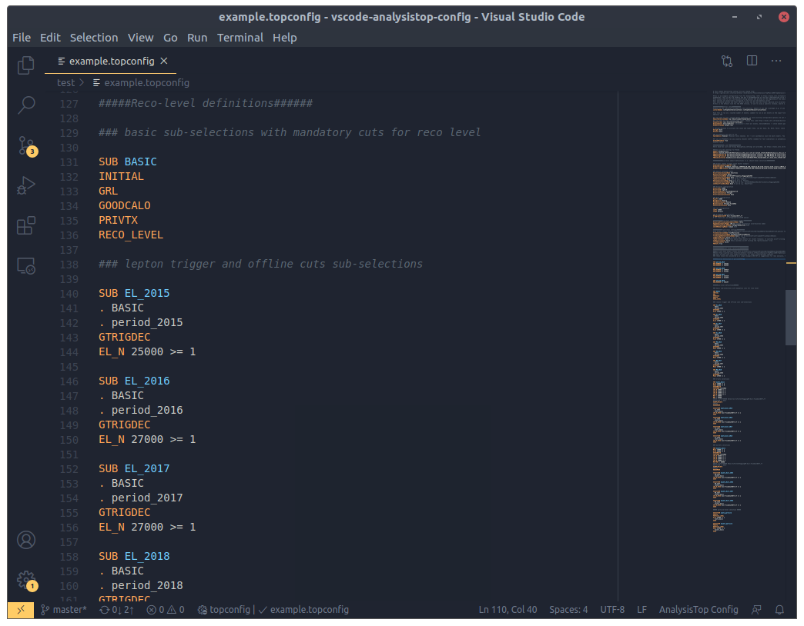

# AnalysisTop Config for VS Code


[AnalysisTop](https://twiki.cern.ch/twiki/bin/viewauth/AtlasProtected/TopxAODStartGuideR21) is a general purpose xAOD analysis framework developed by the [ATLAS](https://atlas.cern/) [Top Group](https://twiki.cern.ch/twiki/bin/view/AtlasProtected/TopWorkingGroup). This extension provides basic syntax highlighting support for AnalysisTop configuration files.



## Features

Currently only basic syntax highlighting is supported. Nothing fancy!

## Install

First, build the extension with VS Code's `vsce` packaging tool. If you do not have `vsce` installed, you can get it with the [Node.js](https://www.npmjs.com/) package manager:

```bash
$ npm install -g vsce
```

Then build the extension from the `vscode-analysistop-config` root directory with

```bash
$ vsce package
```

This will create a `.vsix` file that you can use to install as a VS Code extension. From the command palette (<kbd>Ctrl</kbd> + <kbd>Shit</kbd> + <kbd>P</kbd>), enter **Extensions: Install from VSIX** and navigate to the `.vsix` file you just created. You can now use AnalysisTop syntax highlighting!

For more information on `vsce` packaging and installing extensions, see the [Publishing Extensions](https://code.visualstudio.com/api/working-with-extensions/publishing-extension) and [Extension Marketplace](https://code.visualstudio.com/docs/editor/extension-gallery) articles in the VS Code documentation.
