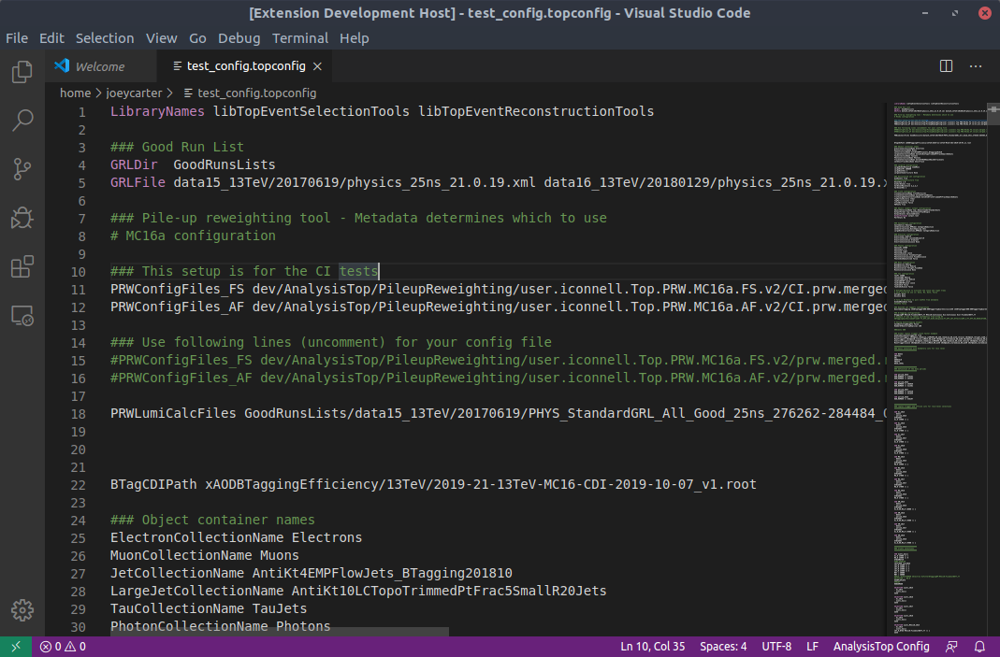

# AnalysisTop Config for VS Code

[AnalysisTop](https://twiki.cern.ch/twiki/bin/viewauth/AtlasProtected/TopxAODStartGuideR21) is a general purpose xAOD analysis framework developed by the [ATLAS](https://atlas.cern/) [Top Group](https://twiki.cern.ch/twiki/bin/view/AtlasProtected/TopWorkingGroup). This extension provides basic syntax highlighting support for AnalysisTop configuration files.

## Features

Currently only basic syntax highlighting is supported. Nothing fancy!
